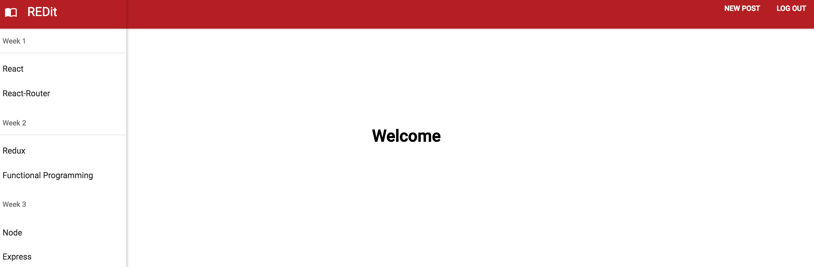

# REDit Clone

Create a Product Hunt / Reddit clone that transforms existing data into a view using posts and categories.

The project must includes imported data (from a JSON file),  React and the Material UI library to build out the application's UI, 
Redux and react-redux to manage application state, and React Router for routing.

I got stuck trying to get my routing to work for the popular and newest URL's i spent most of my time trying to get those to work
and working my way back to a place where my app worked. Currently my upVotes are working onClick. I think there a few areas of confusion
for me between my PostList and my post reducer that if I could clear up I would better understand what to do next. 

I have customized the content of my app

Part 2:

 added the server-side components. The project will have a user login, and allow users to create new posts.

 The project will include a server (Node/Express), a connected database (PostgreSQL), a connected client (React), 
 and form with submit and data validation (Redux-Form), and user authentication.

 I got lost trying to chase down all the things i needed to get done for Monday, so I tried to chip away at what I could to get
 closer to the goals. I'm confused about what to do next with my LoginForm and AddAlbums forms/validation. Also using passport, Jwt 
 and fetch to authenticate routes? I'm also confused about what actions need to take place in the database rather than the reducers.

 I think I can catch up this week with some extra help from the group. 

 

